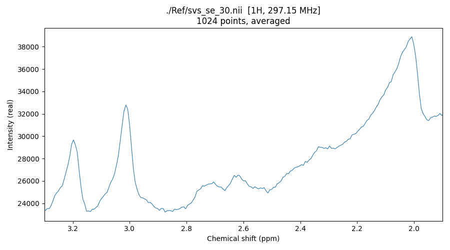

## About

This repository provides example DICOM Magnetic Resonance Spectroscopy data to illustrate conversion to the [BIDS standard](https://bids-specification.readthedocs.io/en/stable/modality-specific-files/magnetic-resonance-spectroscopy.html). At the moment, only Siemens XA60 DICOMs with single-voxel spectroscopy (svs) are provided. It provides a regression test for dcm2niix, but also compares conversion of the native executable dcm2niix to the [spec2nii](https://github.com/wtclarke/spec2nii) Python scripts.

Note that dcm2niix and spec2nii are expected to generate **equivalent**, not **identical**, results. spec2nii embeds spectroscopy-critical details directly into the NIfTI image as a header extension. dcm2niix provides those details in a BIDS-MRS-compatible JSON sidecar. spec2nii uses the NIfTI-2 header layout; dcm2niix uses NIfTI-1. The image data (FID payload + sform + dim/pixdim) is compared byte-for-byte and float32-precise — that's the parity claim. Sidecar comparison ignores informational/provenance fields (see `compare_spec2nii.py` for the master ignore-list rationale).

## Layout

```
In/                   DICOM source files (LFS-tracked .dcm/.IMA)
  XA60/
    30_svs_se/        per-series subfolder; each contains the DICOMs
    31_svs_se/        for that series
Ref/                  per-corpus sidecar baselines (sidecar-only — no .nii)
  local/              baselines for the local corpus
    XA60/
      30_svs_se.json
      31_svs_se.json
  spec2nii/           baselines for the wider spec2nii corpus (populated
                      after a successful `batch.py --corpus spec2nii` run)
Out/                  untracked; created/cleaned by batch.py / compare_spec2nii.py
  local/...           outputs from --corpus local
  spec2nii/...        outputs from --corpus spec2nii
spec2nii/             untracked; populated on demand by compare_spec2nii.py
batch.py              sidecar regression test (per-corpus)
compare_spec2nii.py   live validation test (FID/sform/dim/pixdim vs spec2nii)
spec2nii_compare.py   curated 40-dataset inventory + standalone comparator
                      (moved here from dcm2niix/tools/ once the MRS port
                      stabilised; canonical source of the BIDS-MRS alias
                      map / ignore lists / NIfTI parser used by batch.py
                      and compare_spec2nii.py)
dcm_qa_mrs_lib.py     shared helpers (series discovery, dcm2niix runner)
spec2graph.py         single-voxel spectrum visualisation
```

The per-series subfolder layout is load-bearing: `batch.py` and
`compare_spec2nii.py` invoke dcm2niix with `-f %f` so the NIfTI stem matches
the folder name (`30_svs_se.nii`, etc.). This is the mechanism that pairs
`Ref/local/XA60/30_svs_se.json` with its `Out/local/XA60/30_svs_se.json`
and the spec2nii live-compare's `spec2nii/30_svs_se.nii.gz` cleanly.

**Why is Ref/ sidecar-only?** The `.json` sidecar is the most-fragile,
most-tested surface (large field set, lots of conditional emission, drift-
prone). The `.nii` FID payload is comparatively boring — it's the DICOM
`(5600,0020)` payload with optional XA phase negation, minimal C-side
processing. So Ref/ catches dcm2niix self-drift on the fragile surface,
and `compare_spec2nii.py` catches `.nii` parity drift against spec2nii
(the reference implementation). Removing `.nii` from Ref also keeps the
repo small and out of LFS (only `In/**/*.dcm` and `*.IMA` are LFS-tracked).

## Setup

Clone with LFS:

```bash
git lfs install
git clone https://github.com/<owner>/dcm_qa_mrs.git
```

Requires `dcm2niix` v1.0.20260607 or later (UIH SVS sform fix + Siemens BIDS-MRS coverage) on `PATH`. spec2nii is optional and only needed for `compare_spec2nii.py`:

```bash
pip install spec2nii numpy nibabel matplotlib
```

## Corpora — what each script covers

dcm_qa_mrs has two scripts that cover different (overlapping) corpora:

| Script | `--corpus` | Tests | Validates against |
|---|---|---|---|
| `batch.py` | `local` (default) | DICOMs in `In/` (XA60) | `Ref/local/` sidecars (regression of dcm2niix's own emission) |
| `batch.py` | `spec2nii` | Wider 40-dataset reference (via `$SPEC2NII_DATA`) | `Ref/spec2nii/` sidecars |
| `batch.py` | `both` | Both | Both |
| `compare_spec2nii.py` | `local` (default) | DICOMs in `In/` | spec2nii run live (FID + sform + dim/pixdim + sidecar) |
| `compare_spec2nii.py` | `spec2nii` | Wider corpus | spec2nii run live (delegates to sibling `spec2nii_compare.py`) |
| `compare_spec2nii.py` | `both` | Both | Both |

`batch.py` catches dcm2niix self-drift; `compare_spec2nii.py` catches
cross-tool parity drift against the spec2nii reference implementation. Both
matter. dcm_qa_mrs deliberately does NOT ship the spec2nii corpus — it's
5 GB, already maintained upstream by the spec2nii project, and pointing
at it via an env var keeps this repo small and the fixture canonical.

## Regression test — `batch.py`

```bash
python3 batch.py                                    # --corpus local
python3 batch.py --corpus spec2nii                  # wider corpus (env vars)
python3 batch.py --corpus both
```

Converts each series to `Out/<corpus>/.../<id>.json` and diffs against `Ref/<corpus>/.../<id>.json`. JSON diff ignores `ConversionSoftwareVersion` and `BidsGuess` (historical default); add more via `--ignore <pattern> ...`.

The diff has three outcome categories:
- **DIFFERING**: Ref and Out both exist but values diverge (real regression — investigate).
- **MISSING**: Ref has the file, Out doesn't (dcm2niix failed to convert, or you removed a series).
- **NO-REF**: Out has the file, Ref doesn't (new dataset just added, or one that previously crashed dcm2niix). Informational, not a failure. Promote by copying `Out/<corpus>/.../<id>.json` into `Ref/<corpus>/.../<id>.json` and committing.

Other flags: `--dcm2niix /path/to/dcm2niix`, `--flags ...` (default `-b y -z n -f %f`), `--no-clean`, `--run-skipped` (spec2nii corpus only — include datasets marked `skip_reason` in the dcm2niix inventory), `--indir/--outdir/--refdir`.

## Validation test — `compare_spec2nii.py`

Local corpus (no setup beyond the dcm_qa_mrs clone itself):
```bash
python3 compare_spec2nii.py                           # use cached spec2nii/
python3 compare_spec2nii.py --refresh                 # regenerate spec2nii/
python3 compare_spec2nii.py --series 30_svs_se        # restrict to one series
```

Wider spec2nii corpus (one-time setup required — see next section):
```bash
export SPEC2NII_DATA=/path/to/spec2nii_test_data
python3 compare_spec2nii.py --corpus spec2nii
python3 compare_spec2nii.py --corpus both             # run local + spec2nii
```

The curated 40-dataset inventory + comparison logic lives in the sibling `spec2nii_compare.py` in this same folder — both `batch.py` and `compare_spec2nii.py` find it as a sibling, no env var needed.

### One-time setup: the spec2nii corpus

`--corpus spec2nii` and `--corpus both` need a local clone of the spec2nii_test_data repo. This script does **not** download it — clone once, set the env var, and you're done:

```bash
# Clone OUTSIDE this repo (e.g. alongside it in ~/src) so the 5 GB fixture
# doesn't show up in `git status` for dcm_qa_mrs:
cd ~/src
git clone https://git.fmrib.ox.ac.uk/wclarke/spec2nii_test_data.git
export SPEC2NII_DATA=$PWD/spec2nii_test_data
```

This is ~5 GB and only needs to be done once. The clone is upstream-maintained by the spec2nii project — `git pull` to refresh.

**Will this corrupt dcm_qa_mrs?** No. The clone lives wherever `$SPEC2NII_DATA` points; running `--corpus spec2nii` uses `tempfile.TemporaryDirectory()` for output (nothing lands in dcm_qa_mrs). If you do clone *inside* dcm_qa_mrs (against the recommendation above), `.gitignore` already excludes `spec2nii_test_data/` as a defensive guard.

What gets compared (both corpora):
 - FID payload byte-by-byte (after endian normalisation; both write DT_COMPLEX64)
 - sform under float32 tolerance (1e-4 absolute, 1e-5 relative)
 - dim/pixdim under the same tolerance
 - JSON sidecar key-level diff with the BIDS-MRS alias map (`RxCoil` ↔ `ReceiveCoilName`, etc.)

The first local `--refresh` run records the spec2nii version in `spec2nii/.spec2nii_version`. Subsequent runs warn when the cached version drifts from the current `spec2nii --version`. The `spec2nii/` folder is gitignored — only its tooling is committed; the contents are regenerated on demand.

**Why a remote (env-var) reference instead of vendoring the corpus?** That fixture is 5.1 GB total (3.3 GB DICOM-MRS subset) and is already maintained upstream by the spec2nii project. Vendoring it into dcm_qa_mrs would create a maintenance fork and burn through GitHub LFS quota for no benefit; pointing at the canonical clone is simpler, smaller, and stays current.

## Visualization

A minimal Python script (`spec2graph.py`) is also provided to visualize these samples. It requires `numpy`, `nibabel`, and `matplotlib`:

```bash
pip install numpy nibabel matplotlib
```

Examples (paths assume you've run `batch.py` once to populate Ref/):

```bash
# overlay all 64 transients
python spec2graph.py ./Ref/30_svs_se.nii
# average the transients
python spec2graph.py ./Ref/30_svs_se.nii --average
# zoom to 2–3 ppm, @3T: NAA ~2.02 ppm Cr ~3.03 Cho ~3.22
python spec2graph.py ./Ref/30_svs_se.nii -a --ppm-range 1.9 3.3
# x-axis in Hz
python spec2graph.py ./Ref/30_svs_se.nii -a --hz
# magnitude (also real/imag/phase)
python spec2graph.py ./Ref/30_svs_se.nii -a -m magnitude
# save instead of display
python spec2graph.py ./Ref/30_svs_se.nii -o spec.png
```



## Links

 - BIDS [Magnetic Resonance Spectroscopy](https://bids-specification.readthedocs.io/en/stable/modality-specific-files/magnetic-resonance-spectroscopy.html) specification.
 - [spec2nii](https://github.com/wtclarke/spec2nii) handles a broader range of MR spectroscopy than dcm2niix, and can also process this example dataset.
 - Peer-reviewed [MRS-BIDS](https://pubmed.ncbi.nlm.nih.gov/40781246/) Data Descriptor.
